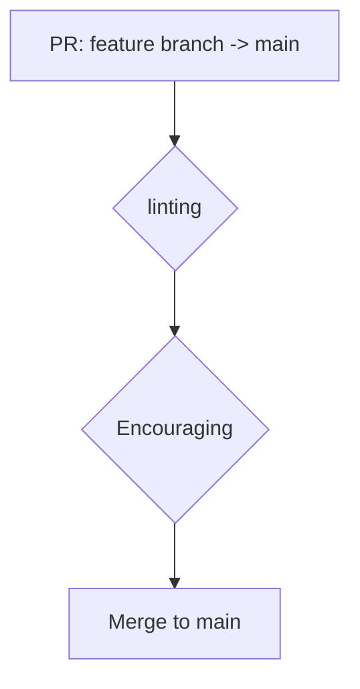

# learning-github

## branch strat

- `main` is protected and can only be changed through PR

A PR must have all actions completed before merge is enabled.

## CI/CD

```mermaid
  graph TD;
      A[PR: feature branch -> main]-->B;
      B{linting}-->C;
      C{Encouraging}-->D[Merge to main];
```
