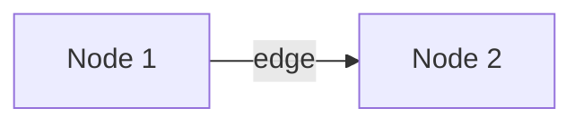
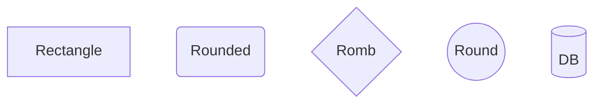
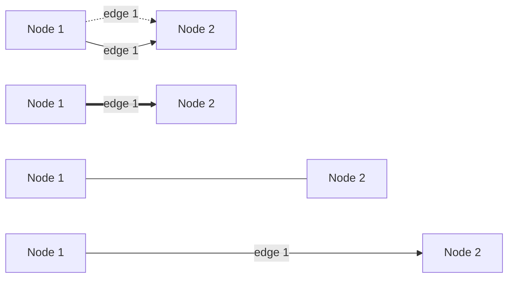
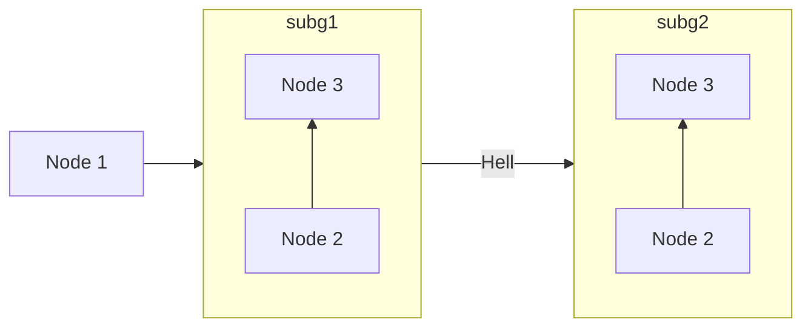
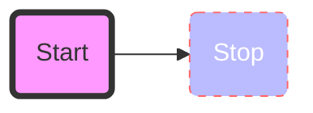
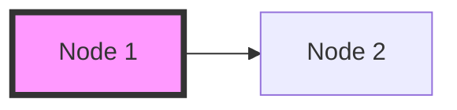

# Why mermaid

From [mermaid docs](https://mermaid-js.github.io/mermaid/#/README):

_The main purpose of Mermaid is to help with Visualizing Documentation,
and helping it catch up with Development._

_Diagramming and Documentation cost precious developer time and get
outdated quickly. However, not having diagrams or documentation ruins
productivity and hampers organizational learning._

_Mermaid addresses this Catch-22 situation by reducing the time, effort
and tooling that is required to create modifiable diagrams and charts
which in turn results in smarter and more reusable content. Mermaid, as
a text-based diagramming tool allows for quick and easy updates and makes
documentation much easier. It can also be included in production scripts
and other pieces of code as per requirement._

## [Live editor](https://mermaid.live/)

This can be used to create charts in the browser. Code can then be copied.

Good stuff but unsure about where data is, and it is rather easy to have
a plugin in VSCode.

## Diagrams and Sytax

Comments in code can be done by `%% comment`

Mermaid offers different diagrams:

### Flow (graph or flowchart)

> OBS: use flowchart in definition, for full support

A flow chart (graph) diagram is composed of nodes and edges between them.



Orientation is set by `LR`, also available:

- TB - top to bottom
- TD - top-down/ same as top to bottom
- BT - bottom to top
- RL - right to left
- LR - left to right

#### Nodes can have different shapes



Available:

- A node in an asymmetric shape
- Rhombus
- Hexagon
- Parallelogram
- Trapeziod
- Cicle
- Cylinder
- Subroutine
- Round edges
- Rectangle

#### Edges are of diffent kinds, can be annotated, and can be of different lengths



#### Subgraphs can be used to section the graph. It uses the syntax

```
subgraph title
    graph definition
end
```



This seems to be only for including flowcharts in subchart. But directions
can be changed.

It is possible to have edges between subgraph and node.

#### Interactions

It is possible to have interactions in the graph, but have not looked into it.

#### Styling

This is a js lib and can handle styling in js and CSS style (I think..).



A style can be applied to and item by `style node-id config` This will only
apply to the specific node.

The style can also be applied as classes. This is easier since the same style can
be applied to many nodes.



The default class can be changed as
`classDef default fill:#f9f,stroke:#333,stroke-width:4px;`
