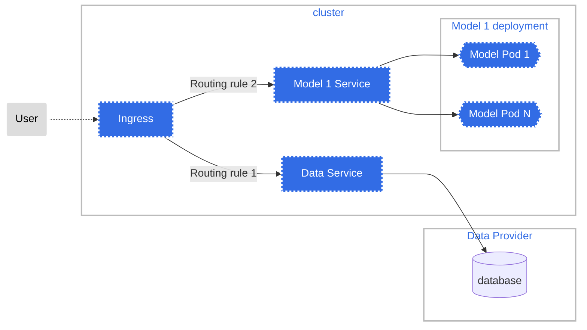

# Title

```mermaid
flowchart LR;

    subgraph cluster
        direction LR
        ingress[Ingress] --Routing rule 1--> dsvc[Data Service]
        ingress --Routing rule 2--> m1svc[Model 1 Service]

       subgraph m1dep[Model 1 deployment]
            direction BT
            m1pod1{{Model Pod 1}}
            m1podn{{Model Pod N}}

        end
    end

    subgraph ddep[Data Provider]
        direction BT
        db1[(database)]
    end
    dsvc --> db1

    m1svc --> m1pod1
    m1svc --> m1podn

    user(User) -.-> ingress

    classDef plain fill:#ddd,stroke:#fff,stroke-width:4px,color:#000;
    classDef k8s fill:#326ce5,stroke:#fff,stroke-width:4px,stroke-dasharray:3,color:#fff;
    classDef cluster fill:#fff,stroke:#bbb,stroke-width:2px,color:#326ce5;
    class ingress,dsvc,m1svc,m2svc k8s;
    class m1pod1,m1podn k8s;
    class m2pod1,m2podn k8s;
    class user plain;
    class cluster cluster;

```

Caption